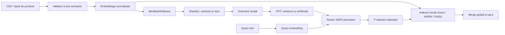

# SSFR — SpectraShard Fourier Router

SSFR este un prototip de cercetare pentru rutarea căutărilor vectoriale într-un
catalog distribuit. Routerul ordonează centroizii shardurilor, îi comprimă pe axa
shardurilor cu transformata Fourier și selectează shardurile relevante folosind
intervale de eroare deterministe.

Repository-ul include întregul flux pentru un catalog e-commerce:

- import CSV validat;
- embeddings locale sau furnizate de un model semantic;
- grupare în sharduri și indexuri locale;
- router SSFR adaptiv;
- căutare text, filtre, CLI interactiv și API;
- fallback exact și evaluare față de oracle;
- benchmarkuri reproductibile;
- un catalog fizic cu 1.000.000 de produse și 256 de categorii.

> SSFR este experimental. Catalogul de un milion de produse este generat și
> validat fizic, dar este sintetic. Configurația de un miliard este o estimare de
> capacitate; nu a fost indexat fizic un miliard de vectori.

## Rezultate curente

| Test | Rezultat | Tip |
|---|---:|---|
| Generare 1.000.000 produse + validare | 21,059 s | măsurat fizic |
| Citire completă cu loaderul SSFR | 8,6 s | măsurat fizic |
| Interogare filtrată SQLite | 0,729 ms | măsurat fizic |
| Căutare warm pe 100.000 vectori, P50 | 0,446 ms | măsurat fizic |
| Căutare warm pe 100.000 vectori, P95 | 0,699 ms | măsurat fizic |
| Recall@10 pe demo-ul de 100.000 | 1,000 | măsurat fizic |
| Router 16.384 × 768, P50 | 2,314 ms | măsurat fizic, fără vectorii produselor |
| Router 16.384 × 768, P95 | 2,971 ms | măsurat fizic, fără vectorii produselor |
| End-to-end pentru 1 miliard | 12,971 ms | estimare bazată pe ipoteze de cluster |

Rezultatele depind de procesor, BLAS, memorie, backendul local, embedding și date.
Rapoartele complete sunt în `reports/`.

## Arhitectură



Faza offline construiește artefactele. Faza online încarcă indexul o singură dată,
transformă query-ul în vector, selectează shardurile, caută local și reunește
rezultatele.

## Pornire rapidă

### Catalogul demonstrativ

În PowerShell:

```powershell
cd "D:\Alexie\algoritmi\SSFR - SpectraShard Fourier Router"
.\cauta.cmd
```

CLI-ul rămâne deschis și acceptă căutări succesive:

```text
Caută > laptop pentru programare
Caută > telefon cu baterie mare
Caută > adidași impermeabili
```

Comenzi utile:

```text
/toate
/top 20
/categorie Electronice
/culoare negru
/pret-max 5000
/stoc da
/fara-filtre
/ajutor
/iesire
```

### Catalogul fizic de un milion

Fișierele sunt deja generate în `data/generated/`. Pentru regenerare:

```powershell
.\.venv\Scripts\python.exe tools\generate_million_products.py --force
```

Construirea indexului SSFR:

```powershell
.\construieste_index_1m.cmd
```

Căutarea după finalizarea build-ului:

```powershell
.\cauta_1m.cmd
```

CLI-ul mare pornește intenționat cu `top 20` și 32/256 sharduri. Comanda `/toate`
ar materializa până la un milion de rezultate și nu este recomandată la această
scară.

## Baza de date de 1.000.000 de produse

| Proprietate | Valoare validată |
|---|---:|
| Produse | 1.000.000 |
| ID-uri unice | 1.000.000 |
| Categorii | 256 |
| Produse/categorie | 3.906–3.907 |
| Rânduri invalide | 0 |
| Erori de cheie străină | 0 |
| SQLite `integrity_check` | `ok` |
| SHA-256 CSV | `03de87af...816b0d6` |

Fișiere:

| Fișier | Dimensiune măsurată |
|---|---:|
| `data/generated/products_1m.csv` | 311,403 MiB |
| `data/generated/products_1m.sqlite` | 415,984 MiB |
| `data/generated/categories_256.csv` | 0,018 MiB |
| Total surse principale | 0,710 GiB |

CSV-ul este intrarea pentru SSFR. SQLite conține tabelele `products` și
`categories`, cheie primară pentru `product_id` și indexuri pentru categorie,
stoc, preț și brand.

## Notație matematică

| Simbol | Semnificație |
|---|---|
| \(N\) | numărul produselor |
| \(d\) | dimensiunea embeddingului |
| \(S\) | numărul total de sharduri |
| \(P\) | numărul de sharduri interogate |
| \(k\) | numărul de rezultate finale |
| \(b\) | cea mai mare frecvență Fourier păstrată |
| \(L\) | numărul benzilor Fourier configurate |
| \(T\) | numărul încercărilor spectrale pentru un query |
| \(n_i\) | numărul produselor din shardul \(i\) |
| \(C \in \mathbb{R}^{S \times d}\) | matricea centroizilor |
| \(q \in \mathbb{R}^{d}\) | embeddingul query-ului |

Pentru căutarea cosinus, vectorii și centroizii sunt normalizați:

\[
\lVert q\rVert_2 = 1,\qquad \lVert x_i\rVert_2 = 1
\]

iar scorul este:

\[
s_i = q^\top x_i = \cos(q,x_i)
\]

## Modelul matematic SSFR

### 1. Centroizii shardurilor

Pentru shardul \(\mathcal{S}_i\), centroidul este media vectorilor, urmată de
normalizare:

\[
\bar c_i = \frac{1}{n_i}\sum_{x\in\mathcal{S}_i}x,
\qquad
c_i = \frac{\bar c_i}{\lVert\bar c_i\rVert_2}
\]

Scorul exact al centroidului pentru query este:

\[
s_i = q^\top c_i
\]

Calcularea tuturor scorurilor exact înseamnă produsul matrice-vector:

\[
s = Cq
\]

### 2. Ordonarea centroizilor

O permutare \(\pi\) încearcă să pună centroizi similari unul lângă altul:

\[
\widetilde c_n = c_{\pi(n)},\qquad n=0,\ldots,S-1
\]

Implementarea implicită folosește `recursive_pca`. FFT-ul este aplicat pe axa
shardurilor, nu pe dimensiunea embeddingului.

### 3. Transformata Fourier

Pentru fiecare frecvență:

\[
F_k =
\sum_{n=0}^{S-1}
\widetilde c_n
e^{-2\pi i kn/S},
\qquad k=0,\ldots,S-1
\]

Pentru o bandă \(b\), se păstrează frecvențele joase
\(\mathcal{K}_b\). În runtime este stocat prefixul rFFT ne-negativ, iar `irfft`
reconstruiește automat partea conjugată.

Centroidul aproximat este:

\[
\widehat c_n^{(b)}
=
\frac{1}{S}
\sum_{k\in\mathcal{K}_b}
F_k e^{2\pi i kn/S}
\]

În loc să reconstruiască mai întâi toți centroizii, query-ul este proiectat direct
în domeniul frecvență:

\[
z_k = F_k^\top q
\]

iar scorurile aproximative sunt:

\[
\widehat s_n^{(b)}
=
\operatorname{IFFT}(z)_n
=
q^\top\widehat c_n^{(b)}
\]

### 4. Intervalul determinist

Reziduul de reconstrucție pentru shardul \(i\) este:

\[
r_i^{(b)}
=
\left\lVert
c_i-\widehat c_i^{(b)}
\right\rVert_2
\]

Din inegalitatea Cauchy–Schwarz:

\[
\left|
q^\top c_i-q^\top\widehat c_i^{(b)}
\right|
\le
\lVert q\rVert_2 r_i^{(b)}
\]

Rezultă intervalul:

\[
L_i^{(b)}
=
\widehat s_i^{(b)}-\lVert q\rVert_2r_i^{(b)}
\]

\[
U_i^{(b)}
=
\widehat s_i^{(b)}+\lVert q\rVert_2r_i^{(b)}
\]

### 5. Certificarea top-\(P\)

Fie \(\mathcal{T}\) mulțimea celor \(P\) sharduri selectate după scorul aproximativ.
Selecția este certificată dacă:

\[
\min_{i\in\mathcal{T}} L_i^{(b)}
\ge
\max_{j\notin\mathcal{T}} U_j^{(b)}
\]

Dacă relația nu este satisfăcută, routerul poate:

1. extinde banda Fourier;
2. încerca din nou certificarea;
3. trece pe produsul exact \(Cq\).

### 6. Certificarea pruningului la nivel de vector

Dacă orice vector din shardul \(i\) respectă:

\[
\lVert x-c_i\rVert_2\le\rho_i
\]

atunci:

\[
q^\top x
\le
U_i^{(b)}+\lVert q\rVert_2\rho_i
\]

După căutarea locală, fie \(\tau_k\) scorul candidatului de pe poziția \(k\).
Shardurile neinterogate sunt certificate ca nerelevante numai dacă:

\[
\max_{j\notin\mathcal{T}}
\left(
U_j^{(b)}+\lVert q\rVert_2\rho_j
\right)
\le \tau_k
\]

Certificatul centroizilor și certificatul vectorilor sunt proprietăți diferite.

### 7. Actualizare incrementală experimentală

Dacă ordinea și numărul shardurilor rămân fixe, schimbarea
\(\Delta c_n\) poate actualiza spectrul:

\[
F'_k
=
F_k
+
\Delta c_n e^{-2\pi i kn/S}
\]

Reziduurile trebuie totuși recalculate.

## Complexitatea temporală

### Build offline

| Etapă | Complexitate |
|---|---|
| Citire și validare CSV | \(O(N)\) |
| Embeddings | dependent de model; cel puțin \(O(Nd)\) pentru materializarea vectorilor |
| MiniBatchKMeans | aproximativ \(O(I\,m\,S\,d + N\,S\,d)\), cu \(I\) batchuri și batch de mărime \(m\) |
| Statistici sharduri în prototipul Python | \(O(NS+Nd)\) |
| Index local exact | \(O(Nd)\) |
| Build HNSW | empiric aproximativ \(O(NM\log(N/S))\), dependent de bibliotecă |
| Ordonare recursive PCA | aproximativ \(O(Sd^2\log S)\) când \(S\gg d\) |
| FFT pe centroizi | \(O(Sd\log S)\) |
| Reconstrucții și reziduuri pentru \(L\) benzi | \(O(LSd\log S)\) |

Build-ul este offline și nu intră în latența fiecărui query.

### Query online

Rutarea exactă:

\[
T_{\text{exact-router}}
=
O(Sd)
\]

O încercare spectrală:

\[
T_{\text{spectral}}
=
O(bd + S\log S + S + P\log P)
\]

Pentru \(T\) încercări cu prefixuri de frecvență reutilizate:

\[
T_{\text{adaptive}}
=
O\left(
b_{\max}d
+
TS\log S
+
TS
+
TP\log P
\right)
\]

Căutarea exactă în \(P\) sharduri echilibrate:

\[
T_{\text{local-exact}}
\approx
O\left(
\frac{PNd}{S}
\right)
\]

Pentru HNSW, costul mediu este subliniar în practică și depinde de `M`,
`ef_search` și distribuția datelor; cel mai rău caz rămâne liniar.

Dacă fiecare shard produce \(k_{\text{local}}\) candidați, numărul candidaților de
merge este:

\[
C_{\text{merge}} = Pk_{\text{local}}
\]

iar selecția finală folosește aproximativ:

\[
O(C_{\text{merge}} + k\log k)
\]

Modul `/toate` caută exact toate produsele:

\[
T_{\text{all}}
=
O(Nd + N\log N),
\qquad
M_{\text{all}}=O(N)
\]

Acesta este motivul pentru care `/toate` nu trebuie folosit la un milion sau un
miliard de produse.

## Complexitatea spațială și formulele de memorie

Valorile de mai jos sunt pentru dtype-urile folosite de implementarea Python:

- vector produs: `float32`, 4 bytes;
- centroid: `float64`, 8 bytes;
- payload Fourier: `complex128`, 16 bytes;
- ID `<U8`: 32 bytes;
- assignment: `int64`, 8 bytes.

### Vectorii produselor

O singură copie a matricei de embeddings:

\[
M_{\text{vectors}}
=
4Nd\ \text{bytes}
\]

Prototipul persistent păstrează `embeddings.npy` și încă o copie împărțită în
indexurile locale:

\[
M_{\text{vectors-current}}
\approx
8Nd\ \text{bytes}
\]

Aceasta este o alegere a prototipului, nu o cerință matematică. În producție,
vectorii pot exista o singură dată în nodurile shardurilor.

### Routerul exact

O matrice de centroizi `float64`:

\[
M_C = 8Sd\ \text{bytes}
\]

Obiectul Python păstrează și matricea ordonată:

\[
M_{C,\text{runtime}}\approx16Sd\ \text{bytes}
\]

Metadatele shardurilor pot conține încă o copie a centroizilor, deci procesul
Python poate ajunge la aproximativ \(24Sd\) bytes înainte de overhead-ul
obiectelor.

### Payloadul spectral

Pentru cea mai mare bandă runtime \(b_{\max}\):

\[
M_F
=
16(b_{\max}+1)d\ \text{bytes}
\]

Reziduurile pentru \(L\) benzi:

\[
M_R
=
8LS\ \text{bytes}
\]

Permutarea și inversa ei:

\[
M_\pi = 16S\ \text{bytes}
\]

Runtime-ul reutilizează un singur prefix rFFT. Pe disc, prototipul salvează fiecare
prefix de bandă:

\[
M_{F,\text{disk}}
=
16d\sum_{\ell=1}^{L}(b_\ell+1)
\]

### ID-uri și assignments

Pentru ID-urile actuale de opt caractere:

\[
M_{\text{IDs}}
=
32N\ \text{bytes/copie}
\]

Cu o copie globală și una în sharduri:

\[
M_{\text{IDs-current}}
\approx
64N\ \text{bytes}
\]

Assignments:

\[
M_{\text{assignments}}
=
8N\ \text{bytes}
\]

## Consum pentru configurația de 1.000.000

Configurația scriptului:

```text
N = 1.000.000
d = 64
S = 256
P = 32
benzi = 8,16,32,64,128
backend auto -> exact, deoarece sunt aproximativ 3.906 produse/shard
```

### Spațiu numeric derivat

| Componentă | Formulă | Dimensiune |
|---|---:|---:|
| Embeddings globale | \(4Nd\) | 244,141 MiB |
| Vectori în indexurile locale | \(4Nd\) | 244,141 MiB |
| Două copii de ID-uri `<U8` | \(64N\) | 61,035 MiB |
| Assignments | \(8N\) | 7,629 MiB |
| Matrice centroizi | \(8Sd\) | 0,125 MiB |
| Payloaduri spectrale persistente | \(16d\sum(b_\ell+1)\) | 0,247 MiB |
| Reziduuri | \(8LS\) | 0,010 MiB |
| Total minim artefacte numerice | — | aproximativ 557,1 MiB |

Totalul minim împreună cu CSV și SQLite este aproximativ:

\[
311{,}403
+
415{,}984
+
557{,}071
\approx
1{,}254\ \text{GiB}
\]

Fișierele de text semantic, Parquet, manifestele și overhead-ul sistemului de
fișiere nu sunt incluse. Pentru întregul workspace după build este prudent să fie
rezervați aproximativ **1,5–2,2 GiB**.

### RAM operațional

| Operație | Date numerice minime | Recomandare practică |
|---|---:|---:|
| Generarea CSV + SQLite | streaming, batch de 10.000 | 1 GiB disponibil |
| Build SSFR, \(d=64\) | matrice de bază 244 MiB, dar cu mai multe copii temporare | minimum 16 GB, recomandat 24–32 GB |
| Servire, index exact | aproximativ 0,5 GB vectori + ID-uri | minimum 8 GB, recomandat 16 GB |
| Build SSFR, \(d=384\) | 1,431 GiB/copie de embeddings | recomandat cel puțin 32 GB |

Recomandările includ obiectele Python, textele, DataFrame-ul Pandas, dicționarele,
normalizările `float64`, KMeans și cache-ul sistemului. Ele sunt estimări
operaționale, nu măsurători RSS ale build-ului complet de un milion. Calculatorul
are aproximativ 15,63 GB RAM, de aceea scriptul mare folosește \(d=64\).

## Estimarea pentru un miliard

Configurația de capacitate:

```text
N = 1.000.000.000
d = 768
S = 16.384
P = 32
b = 256
```

| Componentă | Valoare |
|---|---:|
| Produse medii/shard | 61.035 |
| Produse din universul celor 32 sharduri | 1.953.125 |
| Reducere fan-out | 512× |
| Vectori `float32`, o singură copie | 2,794 TiB |
| Vectori cu replicare 2× | 5,588 TiB |
| Matrice centroizi `float32` | 48 MiB |
| Matrice centroizi `float64` | 96 MiB |
| Payload \(b=256\), `complex128` | 3,012 MiB |
| Reziduuri pentru 7 benzi, `float64` | 0,875 MiB |
| Produse scalare pentru ruta exactă | 12.582.912 |
| Termeni complecși pentru proiecția spectrală | 197.376 |

Un miliard nu încape realist într-un singur proces Python. Este necesară distribuția
vectorilor pe noduri, căutare locală HNSW/FAISS/DiskANN, cereri paralele,
replicare și monitorizare.

Modelul de latență distribuită este:

\[
T_{\text{e2e}}
\approx
T_{\text{router}}
+
\left\lceil\frac{P}{W}\right\rceil
\left(
T_{\text{local,p95}}+T_{\text{network,p95}}
\right)
+
T_{\text{merge}}
\]

Pentru:

```text
router = 2,971 ms
P = W = 32
local = 8 ms
network = 1,5 ms
merge = 0,5 ms
```

rezultă:

\[
T_{\text{e2e}}
\approx
2{,}971+8+1{,}5+0{,}5
=
12{,}971\ \text{ms}
\]

Aceasta este o estimare, nu o măsurătoare fizică pe un miliard de produse.

## Persistență

Artefactele catalogului includ:

```text
artifacts/products/
  catalog_manifest.json
  import_report.json
  products.parquet
  semantic_texts.jsonl
  embeddings.npy
  product_ids.npy
  shard_assignments.npy
  shard_centroids.npy
  shard_radii.npy
  shard_angular_radii.npy
  ssfr_router/
  local_indexes/
```

Routerul conține centroizii exacți pentru fallback, permutările, payloadurile
spectrale, reziduurile și un manifest verificat SHA-256.

## CLI pentru automatizări

Build:

```powershell
.\.venv\Scripts\python.exe -m ssfr.cli build `
  --csv data/products.csv `
  --output artifacts/products `
  --shards 8 `
  --bands 1,2,4 `
  --probe-shards 4 `
  --embedding-provider hash `
  --embedding-dimension 384 `
  --local-index auto
```

Căutare în toate shardurile, dar numai top-10:

```powershell
.\.venv\Scripts\python.exe -m ssfr.cli search `
  --index artifacts/products `
  --query "laptop pentru programare" `
  --top-k 10 `
  --all-shards
```

Toate produsele compatibile, potrivit doar pentru cataloage mici:

```powershell
.\.venv\Scripts\python.exe -m ssfr.cli search `
  --index artifacts/products `
  --query "laptop pentru programare" `
  --all-results
```

## API FastAPI

```powershell
$env:SSFR_INDEX_PATH = "artifacts/products"
$env:SSFR_NATIVE_THREADS = "1"
.\.venv\Scripts\python.exe -m uvicorn demos.api_demo:app `
  --host 127.0.0.1 `
  --port 8000
```

Swagger:

```text
http://127.0.0.1:8000/docs
```

## Instalare

```powershell
python -m venv .venv
.\.venv\Scripts\python.exe -m pip install --upgrade pip setuptools wheel
.\.venv\Scripts\python.exe -m pip install -e ".[dev,api,ann,parquet]"
```

Embedding semantic opțional:

```powershell
.\.venv\Scripts\python.exe -m pip install -e ".[embeddings]"
```

Providerul `hash` este determinist și offline, dar nu înlocuiește un model semantic
antrenat.

## Teste și benchmarkuri

```powershell
.\.venv\Scripts\python.exe -m pytest -q
.\.venv\Scripts\python.exe demos\ecommerce_demo.py --items 100000 --shards 256
.\.venv\Scripts\python.exe benchmarks\benchmark_large_router.py `
  --shards 16384 `
  --dimensions 768 `
  --queries 100 `
  --probe-shards 32 `
  --max-spectral-attempts 0 `
  --native-threads 12
```

Suita curentă: **41 teste trecute**.

## Ce este certificat și ce nu

- Certificatul top-\(P\) demonstrează corectitudinea selecției centroizilor.
- Certificatul de pruning vectorial demonstrează separat că shardurile omise nu pot
  depăși candidatul de pe poziția \(k\).
- Recall măsurat mare nu este același lucru cu o demonstrație matematică.
- Fallback-ul exact nu este o eroare; este mecanismul conservator.
- Un benchmark sintetic nu demonstrează automat performanța pe embeddings reale.

## Limitări

- Compresibilitatea Fourier depinde de date și de ordonarea centroizilor.
- `recursive_pca` este un cost offline.
- Actualizările care schimbă numărul sau ordinea shardurilor cer rebuild.
- Prototipul Python materializează metadatele și mai multe copii ale vectorilor.
- HNSW și FAISS depind de biblioteci native opționale.
- `--all-results` este exhaustiv și nu scalează la milioane de rezultate afișate.
- Catalogul de un milion este sintetic.
- Numerele pentru un miliard sunt estimări de capacitate.

## Documentație suplimentară

- [Ghid explicit în română](TESTING_GUIDE_RO.md)
- [Arhitectură](ARCHITECTURE.md)
- [Notă de cercetare](RESEARCH_NOTE.md)
- [Metodologia benchmarkurilor](BENCHMARKS.md)
